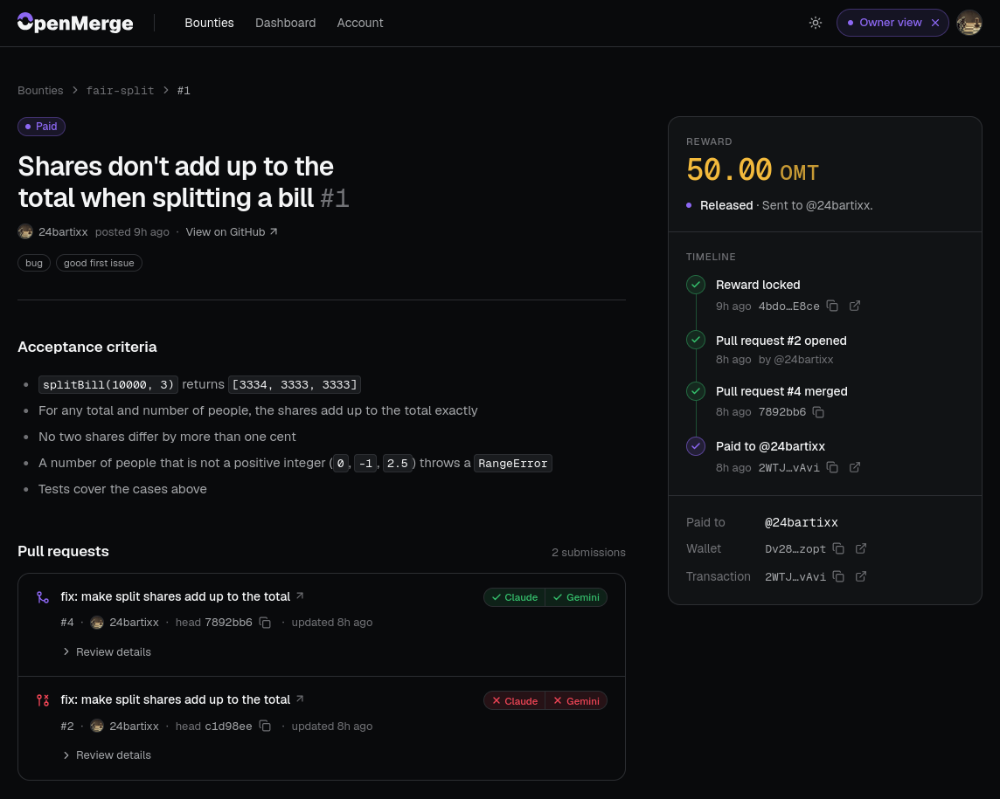
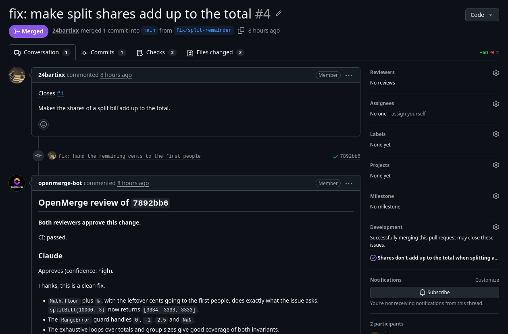

# OpenMerge

**Paid bounties for open-source issues. Merge the pull request, and the developer gets paid.**



Open source runs on unpaid work. Maintainers can't easily pay for a fix, and
contributors have no guarantee they'll be paid when they deliver one. OpenMerge
fixes both sides of that:

1. **Post a bounty.** The maintainer sets a reward, and OpenMerge opens the matching GitHub issue and locks the reward in an escrow on Solana (devnet).
2. **Open a pull request.** Any developer can pick up the issue and submit a fix that says `Closes #N`.
3. **Get a review.** Two AI reviewers (Claude and Gemini) read the PR next to the result of its GitHub Actions run. The verdict shows up on the commit as a commit status and as a PR comment.
4. **Merge to pay.** When the maintainer merges, the reward goes to the wallet the PR author linked, whatever the review said. The review informs the merge; it never gates the payout.

To users it's just GitHub: issues, pull requests and checks. Rewards are paid in
OMT, the project's own Token-2022 token on devnet.



## Trust model

The reward sits in a token vault owned by the escrow program
(`anchor/`, program `9MN1vjVWQpePTmrY7nzMBu5ZeGDtQtCbQvWamJWTDMV3`), not in a
wallet we hold. The program enforces:

- only the verifier key stored in the escrow at creation can release or cancel it;
- an escrow is released or cancelled once, for the full locked amount;
- a cancel refunds only the wallet that funded the escrow.

What it does not enforce yet: the program does not know about GitHub. The API
watches the merge webhook (signature-checked) and picks the recipient from the
PR author's linked wallet. **In this build the API holds both keys**: the server
wallet that funds every escrow and the verifier key that releases it
(`apps/api/src/solana/escrow.service.ts`). Maintainers do not sign the deposit
themselves, and there is no deadline after which a funder can reclaim an
unreleased escrow. Moving the verifier out of the API is the next step.

## Stack

| Part            | Choice                                       |
| --------------- | -------------------------------------------- |
| Web             | Vite 8 · React 19 · Tailwind 4               |
| API             | NestJS 12 · Prisma 7.9.1 · PostgreSQL 17     |
| Escrow          | Anchor program on Solana devnet (`anchor/`)  |
| AI review       | Claude + Gemini, GitHub Actions results      |
| Shared          | `packages/shared` — types used by both sides |
| Package manager | pnpm 10 workspaces                           |

## Quick start

```bash
cp .env.example .env
pnpm install
pnpm setup        # starts Postgres, runs migrations, seeds
pnpm dev          # API on :3000, web on :5173
```

Open <http://localhost:5173>. By default the web app runs on an in-browser mock
of the API, so it works without any keys. Connecting the real API, GitHub,
Solana and the AI reviewers is described in
[docs/development.md](docs/development.md).

## Repository

```
anchor/            escrow program on Solana (Anchor, Rust)
apps/api/          NestJS API: bounties, GitHub, AI review, payouts
apps/web/          Vite + React web app
packages/shared/   types shared by API and web
demo/              scripted demo on a real GitHub repo
```

## Documentation

| Document | What's in it |
|---|---|
| [docs/development.md](docs/development.md) | configuration, scripts, layout, local Postgres and Supabase, migrations |
| [docs/deployment.md](docs/deployment.md) | API on Render, web on Vercel, production variables |
| [anchor/README.md](anchor/README.md) | the escrow program: instructions, accounts, deploy, OMT token |
| [demo/README.md](demo/README.md) | running the demo end to end (in Polish) |
